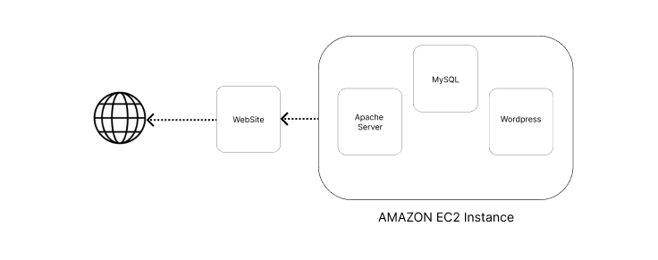

# wordpress_ec2_hosting
Hosting WordPress Website on EC2 instance.

We are Hosting a WordPress website on EC2 instance using Apache webserver and MySQL DataBase.

Step 1 Hosting a t2.micro ec2 Instance on Aws.
Later assign an elastic IP address to the instance to maintain the IP address.
Connecting to ec2 instance using ssh (.pem key)
#ssh -i your-key.pem ec2-user@your-instance-public-dns

Step 2 installing Apache Web Server on the EC2 instance

Step 3 Installing PHP runtime and PHP MySQL connector

Step 4 Download and Install MySQL Server and Configuration.
Creating Authentication.
Creating new Users.
Separate Database for WordPress.
Grant Privilege to new User.

Step 5 Download and Unzip WordPress on EC2.
Move the WordPress Folder to the Apache document root.
Change Config for the Domain name.

